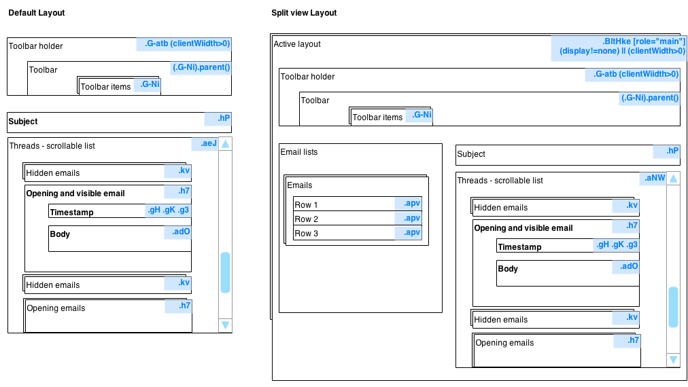

#Gmail HTML DOM Analysis

## General rules

CSS classes:

  * `.kv` => Collapsed email
  * `.kQ` => Collapsed and hidden email
  * `.h7` => Expanded email

More detail in this analysis image:

## Split mode 
Split mode, also known as **Preview Pane**, is Outlook-similar layout. User can enable this mode via **Gmail Labs** setting

Split mode detection:

    $('.BltHke[role="main"]').find('.apv').length>0
    
Explaination:

+ Lists: **Inbox**, **Starred**, **Important**, etc
+ Class `'.BltHke'` => Active list's class
+ Class `'.apv'` => First row (email) in list

## New Inbox mode

### 1. Toolbar button

Toolbar container: `.kP ul.hw`

Toolbar button HTML:

	<li title="Add to Trello" 
	role="button" 
	class="id action actionIcon dS IDHmlf" 
	style="background: red;"></li>

### 2. Data query

Flow: Active list => Active thread => active item => data

#### Active list

	document.querySelectorAll('.rA')

#### Thread (including multi-items)

	document.querySelectorAll('.rA .aJ.S.P')

#### Items:

- All items: `.ad.q1`
- Active item: `.ad.q1.dE`
- Not yet expanded: `.ad.q1.iy`

#### Extract data:

	email = activeItem.querySelector('div[email]').getAttribute('email')
	sender = activeItem.querySelector('div[email]').innerText
	time = activeItem.querySelector('.oU').getAttribute('title')
	body = activeItem.querySelector('.bK')

#### Quick detection email mode

	document.querySelector('.rA .aJ.S.P .ad.q1 div[email]')